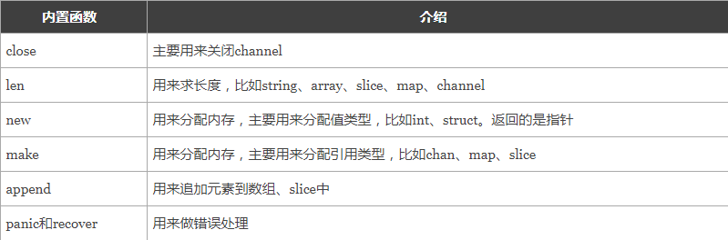
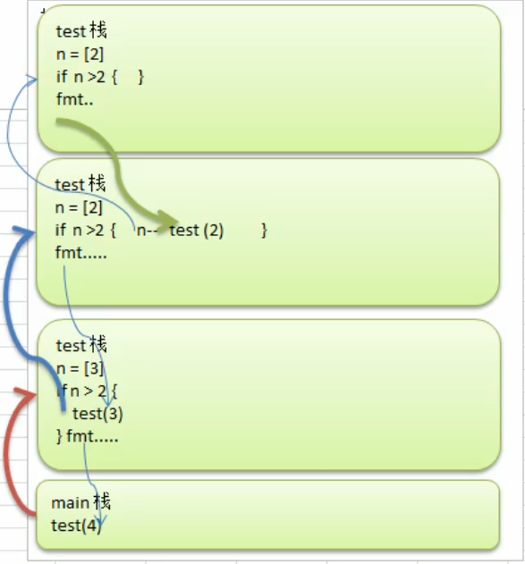

一、函数定义与调用

1.语法

```go
func 函数名(参数)(返回值){
    函数体
}
```

- 函数名：由字母、数字、下划线组成。但函数名的第一个字母不能是数字。在同一个包内，函数名也称不能重名。
- 参数：参数由参数变量和参数变量的类型组成，多个参数之间使用`,`分隔。
- 返回值：返回值由返回值变量和其变量类型组成，也可以只写返回值的类型，多个返回值必须用`()`包裹，并用`,`分隔。
- 函数体：实现指定功能的代码块。

2.实例

```go
package main

import (
	"fmt"
)

//无参函数
func sayHello() {
	fmt.Println("Hello")
}

//有参函数
func calculate(a, b float64) float64 { //函数的参数中如果相邻变量的类型相同，则可以省略类型
	ret := a + b
	return ret
}

//简写有参函数
func calculate2(a, b float64) (ret float64) {
	ret = a + b //已经声明返回值为ret和他的类型，不用:=
	return      //已经声明返回值为ret和他的类型，不用写返回值
}

//可变参数函数
func calculate3(a ...int) int {
	fmt.Println(a) //打印的是一个切片
	sum := 0
	for _, v := range a {
		sum += v
	}
	return sum
}

//固定参数出现，可变产生放后面
func calculate4(a int, b ...int) int {
	fmt.Println(a, b)
	ret := a
	for _, v := range b {
		ret += v
	}
	return ret
}

//多返回值函数写法1
func calculate5(a, b int) (int, int) {
    ret1 := a + b
    ret2 := a - b
	return ret1, ret2
}

//多返回值函数写法2
func calculate6(a, b int) (ret1, ret2 int) {
	ret1 = a + b
	ret2 = a - b
	return
}

func main() {
	//调用无参函数
	sayHello()

	//调用有参函数
	var result float64 = calculate(10.0, 20.1)
	fmt.Println(result)

	//调用可变参数函数
	sum1 := calculate3()                //[]
	sum2 := calculate3(10)              //[10]
	sum3 := calculate3(10, 20)          //[10 20]
	sum4 := calculate3(10, 20, 30)      //[10 20 30]
	fmt.Println(sum1, sum2, sum3, sum4) //0 10 30 60

	//调用有固定参数的可变参数函数
	ret1 := calculate4(0)               //0 []
	ret2 := calculate4(10)              //10 []
	ret3 := calculate4(10, 20)          //10 [20]
	ret4 := calculate4(10, 20, 30)      //10 [20 30]
	fmt.Println(ret1, ret2, ret3, ret4) //0 10 30 60

	//调用多返回值函数写法2
	x, y := calculate6(100, 200)
	fmt.Println(x, y)
    
    //多返回值函数只返回一个值
    _, res := calculate6(100, 200)
    fmt.Println(res)
}
```

注:go语言没有默认参数

3.defer(延迟执行，先入后出执行)

```go
package main

import (
	"fmt"
)

func main() {
	fmt.Println("start ...")
	defer fmt.Println(1)
	defer fmt.Println(2)
	defer fmt.Println(3)
	fmt.Println("end ...")
}
/*
start ...
end ...
3
2
1
*/
```

练习题1

```go
//defer注册要延迟执行的函数时该函数所有的参数都需要确定其值
package main

import (
	"fmt"
)

func calc(index string, a, b int) int {
	ret := a + b
	fmt.Println(index, a, b, ret)
	return ret
}

func main() {
	x := 1
	y := 2
	defer calc("AA", x, calc("A", x, y)) //defer只延迟后面紧跟的语句
	x = 10
	defer calc("BB", x, calc("B", x, y))
	y = 20
}

//A 1 2 3
//B 10 2 12
//BB 10 12 22
//AA 1 3 4
```

练习题2

```go
package main

import "fmt"

func sum(n1, n2 int) int {
	defer fmt.Println("n1 =", n1) //10，变量已被赋值，只是延迟执行，语句已被压入独立的栈，不会改变
	defer fmt.Println("n2 =", n2) //20，当函数执行完毕后，再出栈
	n1++
	n2++
	res := n1 + n2
	fmt.Println("res =", res)
	return res
}

func main() {
	Sum := sum(10, 20)
	fmt.Println("Sum =", Sum)
}

//res = 32
//n2 = 20
//n1 = 10
//Sum = 32
```

Go语言中的`defer`语句会将其后面跟随的语句进行延迟处理。在`defer`归属的函数即将返回时，将延迟处理的语句按`defer`定义的逆序进行执行，也就是说，先被`defer`的语句最后被执行，最后被`defer`的语句，最先被执行

4.函数注意事项

1).数组和基本数据类型都是值传递，即值拷贝，在函数内修改，不会影响原本的值

2).如果希望值传递类型的变量能够通过函数修改值，可以用指针

3).golang不支持函数重载

4).golang可以把函数赋值给变量，变量就是函数类型变量，且可以通过该变量直接调用

5).golang交换两个变量值

```go
package main

import "fmt"

func swap(n1 *int, n2 *int) {
	t := *n1
	*n1 = *n2
	*n2 = t
}

func main() {
	a := 10
	b := 20
	swap(&a, &b)
	fmt.Printf("a=%v, b=%v", a, b)
}
```

二、变量作用域

```go
package main

import (
	"fmt"
)

var num = 10 //全局变量
//Name := "wyl" //会报错，等价于var Name string   Name = "wyl"，赋值语句不能在函数外执行

func pln() {
	//先在自己函数中找，找到了就用自己的
	//没有找到就往外层找全局变量
	num := 100 //局部变量
	fmt.Println("变量num =", num)
}

func main() {
    fmt.Println(num) //10
	pln() //变量num = 100

	abc := pln              //函数可以作为变量
	fmt.Printf("%T\n", abc) //返回的类型是func()
	abc()                   //直接调用
}
```

注:for循环的i也是局部变量

三、函数作为参数或返回值

```go
package main

import (
	"fmt"
)

//函数作为参数
func add(x, y int) int {
	return x + y
}

func sub(x, y int) int {
	return x - y
}

func cal(x, y int, op func(int, int) int) int {
	return op(x, y)
}

//函数作为返回值
func do(s string) (func(int, int) int, error) {
	switch s {
	case "+":
		return add, nil
	case "-":
		return sub, nil
	default:
		err := errors.New("无法识别的操作符")
		return nil, err
	}
}

func main() {
	r1 := cal(100, 200, add)
	fmt.Println(r1)
	r2 := cal(100, 200, sub)
	fmt.Println(r2)
    
    r3 := do("s")
    fmt.Println(r3)
}
```

四、匿名函数

```go
package main

import (
	"fmt"
)

func main() {
	// 将匿名函数保存到变量
	add := func(x, y int) {
		fmt.Println(x + y)
	}
	add(10, 20) // 通过变量调用匿名函数

	//自执行函数：匿名函数定义完加()直接执行
	func(x, y int) {
		fmt.Println(x + y)
	}(10, 20)
}
```

五、闭包

1.初级案例

```go
//定义一个函数，它的返回值是函数
func a(name string) func() {
	return func() {
		fmt.Println("Hello ", name)
	}
}

func main() {
	//闭包=函数 + 外层变量的引用
	r := a("wyl") //r次数相当于一个闭包
	r()           //相当于执行a函数内部的匿名函数
}
```

```go
func adder() func(int) int {
	var x int
	return func(y int) int {
		x += y
		return x
	}
}
func main() {
	var f = adder()
	fmt.Println(f(10)) //10
	fmt.Println(f(20)) //30
	fmt.Println(f(30)) //60

	f1 := adder()
	fmt.Println(f1(40)) //40
	fmt.Println(f1(50)) //90
}
```

```go
func adder2(x int) func(int) int {
	return func(y int) int {
		x += y
		return x
	}
}
func main() {
	var f = adder2(10)
	fmt.Println(f(10)) //20
	fmt.Println(f(20)) //40
	fmt.Println(f(30)) //70

	f1 := adder2(20)
	fmt.Println(f1(40)) //60
	fmt.Println(f1(50)) //110
}
```

2.中级案例

```go
func makeSuffixFunc(suffix string) func(string) string {
	return func(name string) string {
		if !strings.HasSuffix(name, suffix) {
			return name + suffix
		}
		return name
	}
}

func main() {
	jpgFunc := makeSuffixFunc(".jpg")
	txtFunc := makeSuffixFunc(".txt")
	fmt.Println(jpgFunc("test")) //test.jpg
	fmt.Println(txtFunc("test")) //test.txt
}
```

3.高级案例

```go
func calc(base int) (func(int) int, func(int) int) {
	add := func(i int) int {
		base += i
		return base
	}

	sub := func(i int) int {
		base -= i
		return base
	}
	return add, sub
}

func main() {
	f1, f2 := calc(10)
	fmt.Println(f1(1), f2(2)) //11 9
	fmt.Println(f1(3), f2(4)) //12 8
	fmt.Println(f1(5), f2(6)) //13 7
}
```

4.常用内置函数



**注意：**

1. `recover()`必须搭配`defer`使用。
2. `defer`一定要在可能引发`panic`的语句之前定义。

六、递归调用

1.递归基本案例

```go
package main

import "fmt"

func test(n int) {
	if n > 2 {
		n--
		test(n)
	}
	fmt.Println(n)
}

func main() {
	test(4)
}

//2
//2
//3
```



注:

1).执行一个函数就创建一个新函数栈

2).当一个函数执行完毕或者return时自身就会销毁，栈的空间也会解放出来

2.斐波拉契数列

```go
package main

import "fmt"

func fblq(n int) int {
	if n == 1 || n == 2 {
		return 1
	} else if n >2 {
		return fblq(n-1) + fblq(n-2)
	} else {
		return 0
	}
}

func main() {
	var n int
	fmt.Scanln(&n)
	result := fblq(n)
	fmt.Println(result)
}
```

3.猴子吃桃

```go
package main

import "fmt"

func eatPeaches(n int) int {
	if n == 10 {
		return 1
	} else if n > 0 && n < 10 {
		return (eatPeaches(n + 1) + 1) * 2
	} else {
		fmt.Println("输入天数有误")
		return 0
	}
}

func main() {
	res := eatPeaches(1)
	fmt.Println(res)
}
```

七、init函数

1.先初始化全局变量，再执行init函数，再执行main函数

2.调用时可以进行初始化
<<<<<<< HEAD

八、字符串函数

```go
package main

import (
	"fmt"
	"strconv"
	"strings"
)

func main() {
	//1.统计字符串长度
	str := "wyl王艺霖"
	fmt.Println(len(str)) //go采用utf-8编码格式，按字节计数，英文和数字占1个字节，汉字占3个字节

	//2.字符串遍历，同时处理有中文的问题
	str2 := "hello 北京"
	r := []rune(str2)
	for i := 0; i < len(r) ; i++  {
		fmt.Printf("字符=%c\n", r[i])
	}

	//3.字符串转整数，n， err := strconv.Atoi("hello")
	n, err := strconv.Atoi("hello")
	if err != nil {
		fmt.Println("转换错误", err)
	} else {
		fmt.Println("转成的结果是:", n)
	}

	//4.整数转字符串，str = strconv.Itoa()
	str3 := strconv.Itoa(123456)
	fmt.Printf("str3=%v, str3=%T", str3, str3)

	//5.字符串 转 []byte: var bytes = []byte("hello go")
	var bytes = []byte("hello go")
	fmt.Printf("bytes=%v\n", bytes)

	//6.[]byte 转 字符串: str = string([]byte{97, 98, 99})
	str4 := string([]byte{97, 98, 99})
	fmt.Printf("str4=%v\n", str4)

	//7.进制转换，strconv包有
	str5 := strconv.FormatInt(123, 2)
	fmt.Printf("str5=%v\n", str5)

	//8.查找字符串是否在指定字符串中
	b := strings.Contains("seafood", "oo")
	fmt.Printf("b=%v\n", b)

	//9.统计一个字符串有几个指定字符串
	num := strings.Count("seafood", "o")
	fmt.Printf("num=%v\n", num)

	//10.不区分字符串大小写比较
	c := strings.EqualFold("abc", "AbC")
	fmt.Printf("c=%v\n", c)
	fmt.Println("abc" == "AbC")

	//11.返回字串在字符串第一次出现的index
	firstindex := strings.Index("BDC_abc", "a")
	fmt.Printf("firstindex=%v\n", firstindex)

	//12.返回字串在字符串最后一次出现的index
	lastindex := strings.LastIndex("go golang", "go")
	fmt.Printf("lastindex=%v", lastindex)

	//13.将指定的字串替换成其他字串，Replace(s, old, new string, n int)，n代表替换个数，n=-1为全部替换
	str6 := strings.Replace("go golang", "go", "go语言", -1)
	fmt.Printf("str6=%v", str6) //str6本身并未变化

	//14.按照指定的某个字符进行分割，将其分割成字符串
	strArr := strings.Split("hello,go,java,c", ",")
	for i := 1; i < len(strArr); i++ {
		fmt.Printf("str[%v]=%v\n", i, strArr[i])
	}
	fmt.Printf("strArr=%v\n", strArr)

	//15.字符串大小写转换
	str7 := "Hello Golang"
	str7 = strings.ToLower(str7)
	fmt.Printf("str7=%v\n", str7)
	str7 = strings.ToUpper(str7)
	fmt.Printf("str7=%v\n", str7)

	//16.将字符串左右两边空格去掉
	str8 := " Hello Golang How Are You "
	str8 = strings.TrimSpace(str8)
	fmt.Printf("str8=%v\n", str8)

	//17.将字符串左右两边指定的字符去掉
	str9 := "! Hello ! "
	str9 = strings.Trim(str9, "! ")
	fmt.Printf("str9=%v\n", str9)

	//18.将字符串左边指定的字符去掉
	str10 := "! Hello ! "
	str10 = strings.TrimLeft(str10, "! ")
	fmt.Printf("str10=%v\n", str10)

	//19.将字符串右两边指定的字符去掉
	str11 := "! Hello ! "
	str11 = strings.TrimRight(str11, "! ")
	fmt.Printf("str11=%v\n", str11)

	//20.判断字符串是否以指定字符串开头
	str12 := "How are you"
	start := strings.HasPrefix(str12, "How")
	fmt.Printf("start=%v\n", start)

	//21.判断字符串是否以指定字符串开头
	str13 := "How are you"
	end := strings.HasPrefix(str13, "Y")
	fmt.Printf("end=%v\n", end)
}
```

九、时间和日期函数

```go
package main

import (
	"fmt"
	"strconv"
	"time"
)

func test() {
	str := ""
	for i := 0; i < 100000 ; i++ {
		str += "hello" + strconv.Itoa(i)
	}
}

func main() {
	//1.获取当前时间
	now := time.Now()
	fmt.Println(now)

	//2.获取年月日，时分秒
	fmt.Println(now.Year())
	fmt.Println(now.Month()) //November
	fmt.Println(int(now.Month())) //输出数字而不是英文月份
	fmt.Println(now.Day())
	fmt.Println(now.Hour())
	fmt.Println(now.Minute())
	fmt.Println(now.Second())

	//3.格式化输出日期
	//方式一
	fmt.Printf("当前日期为 %d-%d-%d %d:%d:%d\n", now.Year(), now.Month(), now.Day(), now.Hour(), now.Minute(), now.Second())

	//方式二,格式可以修改但数据不能变
	fmt.Printf(now.Format("2006-01-02 15:04:05"))
	fmt.Println()
	fmt.Printf(now.Format("2006-01-02"))
	fmt.Println()
	fmt.Printf(now.Format("15:04:05"))
	fmt.Println()

	//4.指定时间
	//const (
	//	Nanosecond  Duration = 1
	//	Microsecond          = 1000 * Nanosecond
	//	Millisecond          = 1000 * Microsecond
	//	Second               = 1000 * Millisecond
	//	Minute               = 60 * Second
	//	Hour                 = 60 * Minute
	//)

	//5.每隔0.1s打印一个数字，打印到100结束
	i := 0
	for {
		i++
		fmt.Println(i)
		time.Sleep(time.Millisecond*100)
		if i == 100 {
			break
		}
	}

	//6.获取unix时间戳unixnano时间戳
	fmt.Printf("unix时间戳=%v unixnano时间戳=%v\n", now.Unix(), now.UnixNano())

	//7.计算函数执行时间
	starttime := time.Now().Unix()
	test()
	endtime := time.Now().Unix()
	times := endtime - starttime
	fmt.Printf("执行时间=%v\n", times)
}
```

十、错误处理

1.错误处理机制

```go
package main

import "fmt"

func test() {
	//使用defer + recover
	defer func() {
		err := recover()
		if err != nil {
			fmt.Println("err =", err)
		}
	}()
	num1 := 10
	num2 := 0
	res := num1 / num2
	fmt.Printf("res=%v", res)
}

func main() {
	test()
	fmt.Println("main后面的函数")
}
```

2.自定义处理错误

```go
package main

import (
	"errors"
	"fmt"
)

func readConf(name string) (err error) {
	if name == "config.ini" {
		return nil
	} else {
		return errors.New("读取文件错误")
	}
}

func test1() {
	err := readConf("config2.ini")
	if err != nil {
		//如果读取文件错误，就输出这个错误并终止程序
		panic(err)
	}
	fmt.Println("继续执行")
}

func main() {
	test1()
	fmt.Println("没有问题")
}
```

=======
>>>>>>> f83078fd63c58c59e01233bc73e9f1fd8ccf4ab7
