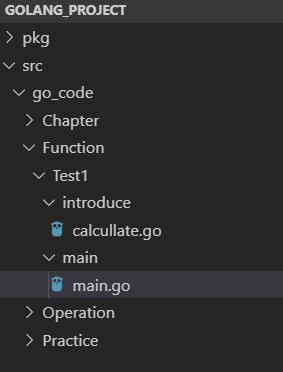
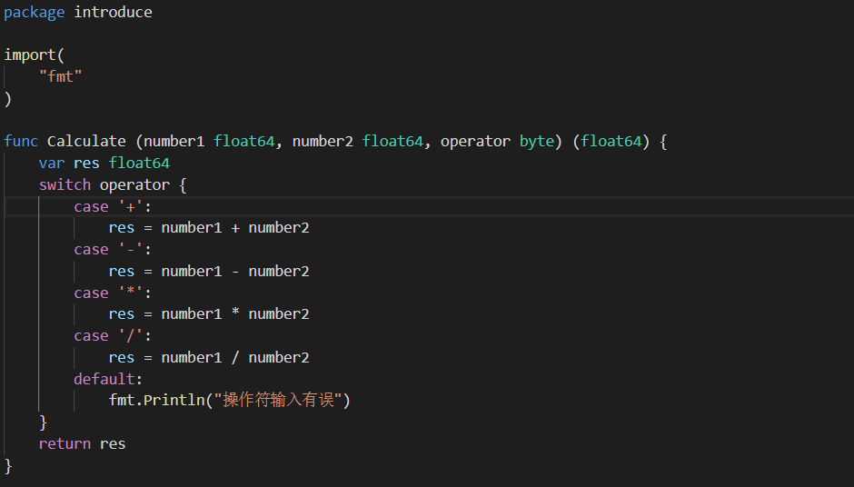
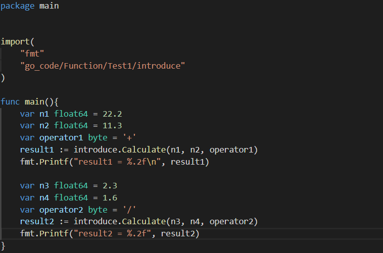
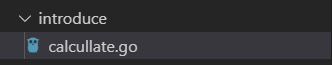
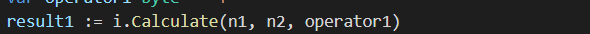

一、函数定义与调用

1.语法

```go
func 函数名(参数)(返回值){
    函数体
}
```

- 函数名：由字母、数字、下划线组成。但函数名的第一个字母不能是数字。在同一个包内，函数名也称不能重名。
- 参数：参数由参数变量和参数变量的类型组成，多个参数之间使用`,`分隔。
- 返回值：返回值由返回值变量和其变量类型组成，也可以只写返回值的类型，多个返回值必须用`()`包裹，并用`,`分隔。
- 函数体：实现指定功能的代码块。

2.实例

```go
package main

import (
	"fmt"
)

//无参函数
func sayHello() {
	fmt.Println("Hello")
}

//有参函数
func calculate(a, b float64) float64 { //函数的参数中如果相邻变量的类型相同，则可以省略类型
	ret := a + b
	return ret
}

//简写有参函数
func calculate2(a, b float64) (ret float64) {
	ret = a + b //已经声明返回值为ret和他的类型，不用:=
	return      //已经声明返回值为ret和他的类型，不用写返回值
}

//可变参数函数
func calculate3(a ...int) int {
	fmt.Println(a) //打印的是一个切片
	sum := 0
	for _, v := range a {
		sum += v
	}
	return sum
}

//固定参数出现，可变产生放后面
func calculate4(a int, b ...int) int {
	fmt.Println(a, b)
	ret := a
	for _, v := range b {
		ret += v
	}
	return ret
}

//多返回值函数
func calculate5(a, b int) (ret1, ret2 int) {
	ret1 = a + b
	ret2 = a - b
	return
}

func main() {
	//调用无参函数
	sayHello()

	//调用有参函数
	var result float64 = calculate(10.0, 20.1)
	fmt.Println(result)

	//调用可变参数函数
	sum1 := calculate3()                //[]
	sum2 := calculate3(10)              //[10]
	sum3 := calculate3(10, 20)          //[10 20]
	sum4 := calculate3(10, 20, 30)      //[10 20 30]
	fmt.Println(sum1, sum2, sum3, sum4) //0 10 30 60

	//调用有固定参数的可变参数函数
	ret1 := calculate4(0)               //0 []
	ret2 := calculate4(10)              //10 []
	ret3 := calculate4(10, 20)          //10 [20]
	ret4 := calculate4(10, 20, 30)      //10 [20 30]
	fmt.Println(ret1, ret2, ret3, ret4) //0 10 30 60

	//调用多返回值函数
	x, y := calculate5(100, 200)
	fmt.Println(x, y)
}
```

注:go语言没有默认参数

3.defer(延迟执行)

```go
package main

import (
	"fmt"
)

func main() {
	fmt.Println("start ...")
	defer fmt.Println(1)
	defer fmt.Println(2)
	defer fmt.Println(3)
	fmt.Println("end ...")
}
/*
start ...
end ...
3
2
1
*/
```

Go语言中的`defer`语句会将其后面跟随的语句进行延迟处理。在`defer`归属的函数即将返回时，将延迟处理的语句按`defer`定义的逆序进行执行，也就是说，先被`defer`的语句最后被执行，最后被`defer`的语句，最先被执行

二、包的使用







注:

1.方法名要大写，小写为私有，挎包使用要大写，否则无法调用(变量也要大写)

2.文件名和包名最好一致




3.引入包时不需要带src，因为环境变量$GOPATH已经配置了，编译器自动在src下开始

4.包名如果过长，可以取别名，但原来包名就不能用来访问变量和方法




5.在同一文件和包下不能有相同函数

6.要编译生成可执行文件，必须将一个包命名成main包，即package main(main包只能有一个)，编译后会把其他包打包成后缀为.a的库文件
