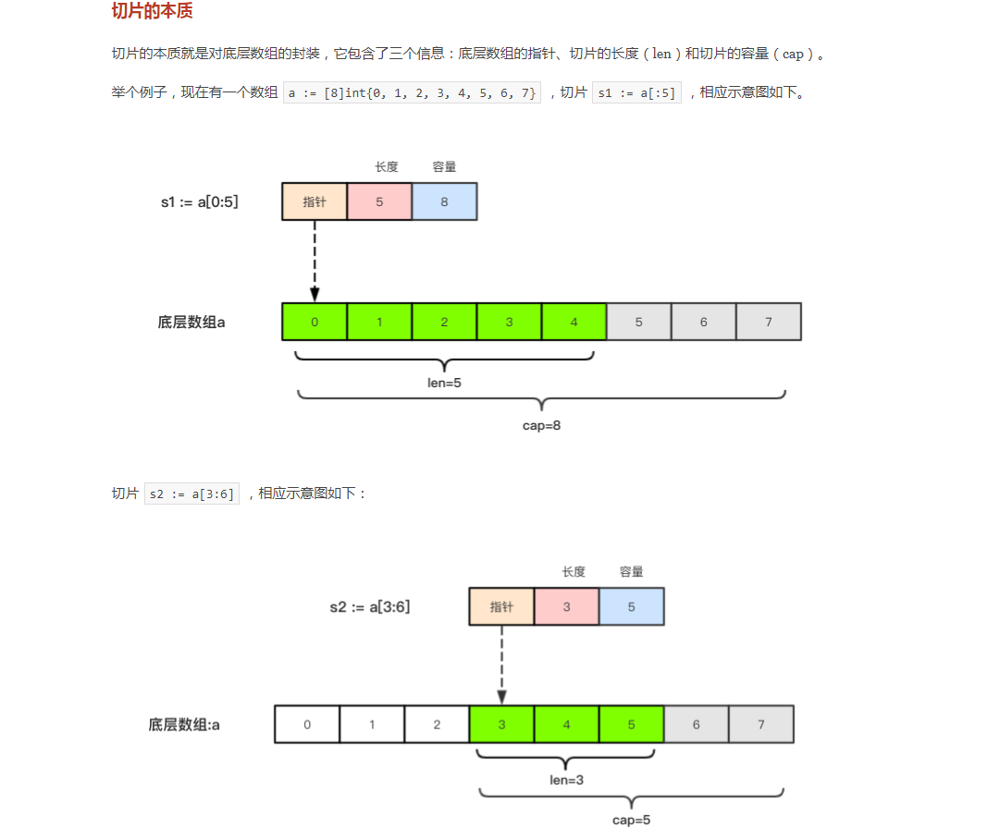

一、切片定义及初始化

```go
package main

import (
	"fmt"
)

func main() {
	//切片定义
	var a []string
	var b []int

	fmt.Println(a)
	fmt.Println(b)

	//切片定义及初始化
	var c = []bool{false, true}

	fmt.Println(c)

	//基于数组得到切片
	array := [5]int{5, 6, 7, 8, 9}
	array1 := array[1:4]
	fmt.Println(array1)
	fmt.Printf("%T\n", array1)

	//切片再次切片
	array2 := array1[0:len(array1)]
	fmt.Println(array2)
	fmt.Printf("%T\n", array2)

	//make函数构造切片
	d := make([]int, 5, 10) //第一个参数为类型；第二个参数为切片长度；第三个参数为切片容量，不写默认和切片长度一样
	fmt.Println(d)
	fmt.Printf("%T\n", d)

	//通过len()函数获取切片长度
	fmt.Println(len(d))

	//通过cap()函数获取切片容量
	fmt.Println(cap(d))
}
```



二、切片的比较

注:切片不能直接用于比较

```go
package main

import (
	"fmt"
)

func main() {
	var a []int     //声明int类型切片
	var b = []int{} //声明并初始化
	c := make([]int, 0)

	if a == nil {
		fmt.Println("a==nil")
	}
	fmt.Println(a, len(a), cap(a))

	if b == nil {
		fmt.Println("b==nil")
	}
	fmt.Println(b, len(b), cap(b))

	if c == nil {
		fmt.Println("c==nil")
	}
	fmt.Println(c, len(c), cap(c))

	//判断切片是否为空
	if len(a) == 0 { //不能用a == nil比较
		fmt.Println("切片为空")
	}
}
/*
结果为
a==nil
[] 0 0
[] 0 0
[] 0 0
切片为空
*/
```

三、切片的赋值拷贝

```go
package main

import (
	"fmt"
)

func main() {
	a := make([]int, 3)
	b := a

	b[0] = 100

	fmt.Println(a) //[100,0,0]
	fmt.Println(b) //[100,0,0]
}
```

注:拷贝是共用的底层数组

四、切片的遍历

```go
package main

import (
	"fmt"
)

func main() {
	a := []int{1, 2, 3, 4, 5}

	//普通遍历
	for i := 0; i < len(a); i++ {
		fmt.Println(i, a[i])
	}

	fmt.Println()

	//for range 遍历
	for index, value := range a {
		fmt.Println(index, value)
	}
}
```

五、切片的扩容

```go
package main

import (
	"fmt"
)

func main() {
	var a []int //没有申请内存
	//a[0] = 100 //编译通过，运行错误

	//添加单一元素
	for i := 0; i < 10; i++ {
		a = append(a, i)
		fmt.Printf("a:%v len:%d cap:%d ptr:%p\n", a, len(a), cap(a), a)
	}

	//添加多个元素
	var b []int
	b = append(b, 1, 2, 3, 4, 5)
	fmt.Println(b)

	//切片元素堆加
	c := []int{12, 13, 14, 15}
	b = append(b, c...)
	fmt.Println(b)
}
```

注:切片的容量按照1,2,4,8,16方式来开辟内存空间

六、切片的复制

```go
package main

import (
	"fmt"
)

func main() {
	a := []int{1, 2, 3, 4, 5}
	b := make([]int, 5, 5)
	copy(b, a) //a数组赋值给b数组
	fmt.Println(a)
	fmt.Println(b)

	b[0] = 100
	fmt.Println(a) //[1, 2, 3, 4, 5]
	fmt.Println(b) //[100, 2, 3, 4, 5]
}
```

注:copy复制的两个数组不指向同一底层数组

七、切片删除元素与排序

```go
package main

import (
	"fmt"
	"sort"
)

func main() {
	//append(a[:index], a[index+1:]...)
	a := []string{"北京", "上海", "深圳", "广州"}
	a = append(a[0:2], a[3:]...)
	fmt.Println(a) //[北京 上海 广州]

	//排序
	var b = []int{8, 7, 13, 9, 2}
	sort.Ints(b)
	fmt.Println(b) //[2 7 8 9 13]
}
```

