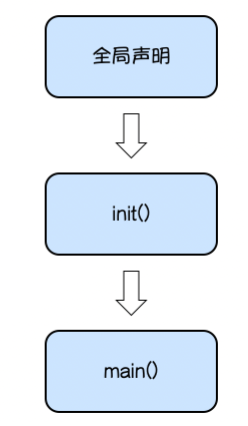
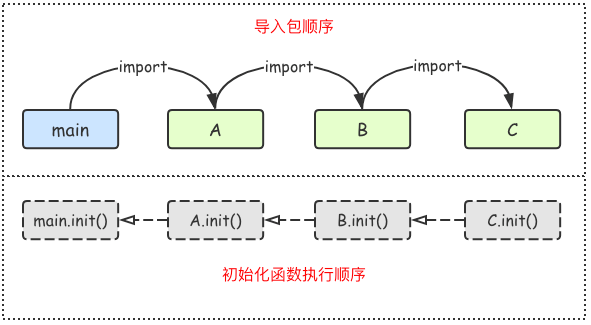

一、定义包

```go
package 包名
```

注意事项：

1.一个文件夹下面只能有一个包，同样一个包的文件不能在多个文件夹下

2.包名可以不和文件夹的名字一样，包名不能包含`-`符号

3.包名为main的包为应用程序的入口包，编译时不包含main包的源代码时不会得到可执行文件

二、可见性

```go
package pkg2

import "fmt"

// 包变量可见性

var a = 100 // 首字母小写，外部包不可见，只能在当前包内使用

// 首字母大写外部包可见，可在其他包中使用
const Mode = 1

type person struct { // 首字母小写，外部包不可见，只能在当前包内使用
	name string
}

// 首字母大写，外部包可见，可在其他包中使用
func Add(x, y int) int {
	return x + y
}

func age() { // 首字母小写，外部包不可见，只能在当前包内使用
	var Age = 18 // 函数局部变量，外部包不可见，只能在当前函数内使用
	fmt.Println(Age)
}
```

注意事项:结构体中的字段名和接口中的方法名如果首字母都是大写，外部包可以访问这些字段和方法

三、包的导入

```go
import "包的路径"

//单行导入
import "包1"
import "包2"

//多行导入
import (
    "包1"
    "包2"
)

//自定义包名
import 别名 "包的路径"

//匿名导入包
import _ "包的路径" //多用于导入驱动
```

注意事项：

1.import导入语句通常放在文件开头包声明语句的下面。

2.导入的包名需要使用双引号包裹起来。

3.包名是从`$GOPATH/src/`后开始计算的，使用`/`进行路径分隔。

4.Go语言中禁止循环导入包。

5.给包取别名后，原来的包名就不能用来访问变量和方法

6.要编译生成可执行文件，必须将一个包命名成main包，即package main(main包只能有一个)，编译后会把其他包打包成后缀为.a的库文件

7.文件名和包名最好一致

三、练习

编写一个`clac`包实现加减乘除四个功能函数，在`snow`这个包中导入并使用加减乘除四个函数实现数学运算

文件夹clac

```go
package clac

//Add 加法函数
func Add(x, y int) int {
	return x + y
}

//Sub 减法函数
func Sub(x, y int) int {
	return x - y
}

//Mul 乘法函数
func Mul(x, y int) int {
	return x * y
}

//Div 除法函数
func Div(x, y int) int {
	return x / y
}
```

文件夹snow

```go
package main

import (
	"Golang_Notes/Packages/clac"
	"fmt"
)

func main() {
	a := clac.Add(1, 4)
	b := clac.Sub(2, 3)
	c := clac.Mul(4, 6)
	d := clac.Div(4, 2)

	fmt.Println(a)
	fmt.Println(b)
	fmt.Println(c)
	fmt.Println(d)
}
```

四、init初始化函数

在Go语言程序执行时导入包语句会自动触发包内部`init()`函数的调用。需要注意的是： `init()`函数没有参数也没有返回值。 `init()`函数在程序运行时自动被调用执行，不能在代码中主动调用它

1.包中init函数执行时机

```go
package main

import "fmt"

var x int = 10

const pi = 3.14

func init() {
    fmt.Println(x)
}

func main() {
    fmt.Println("Hello wyl")
}

//10
//Hello wyl
```



2.init()函数执行顺序


