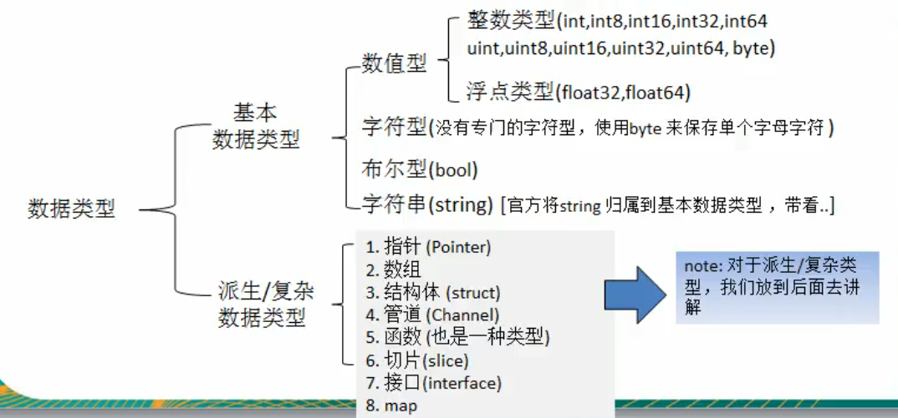
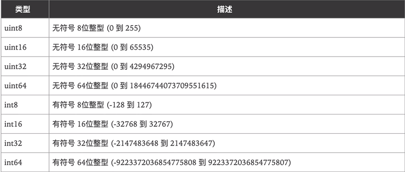
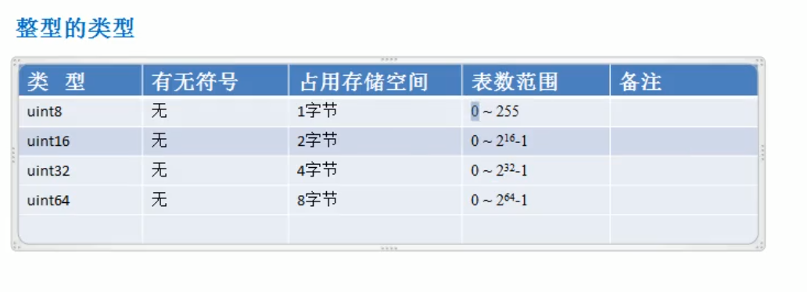
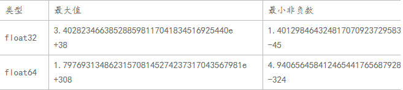

一、数据类型概要



二、整数类型

1.整型



2.其他数字类型



注:

a.使用int和uint时要注意平台

b.在写二进制文件时不要使用int和uint

三、浮点数类型



注:

a.默认为float64

b.浮点数尾数可能丢失，造成精度损失

c.浮点数科学表示法的e和E都可以

四、字符型

```go
func main(){
    var c1 byte = 'a'
    //输出对于字符码值
    fmt.Println(c1)
    //输出字符本身
    fmt.Println("%c \n ", c1)
    
    var c2 int = '中' //用byte会溢出
    //输出对于字符码值
    fmt.Println(c2)
     //输出字符本身
    fmt.Printf("%c \n ", c2)
    
    var c3 int = 22113
    //输出对应unicode字符
    fmt.Printf("%c \n ", c3)
    
    var c4 int = 10 + 'a'
    //用码值进行运算，输出码值
    fmt.Println(c4)
    //用码值进行运算，输出ASCII码
    fmt.Printf("%c \n ", c4)
}
```

注:

1.字符型只能存字母，字母占一个字节，汉字占三个字节

2.Golang没有字符型，一般用byte，使用UTF-8编码

3.如果小于255用byte，否则用int

4.byte:unit8的别名；rune:int32的别名

五、布尔类型

1.默认为false

2.只能取true或false，不能用0或1代替

3.不能将整型强制转换为布尔型

4.布尔值不能参与运算

六、字符串类型

1.在Golang中字符串不可变

2.转义


3.使用反引号``，输出大批代码，不用转义

4.字符串拼接过长时可以换行，但要把+留在上面

5.字符串常用操作


七、复数

complex64和complex128

```go
var c1 complex64 = 1 + 2i //使用两个float32数作为实部和虚部
var c2 complex128 = 2 + 3i //使用两个float64数作为实部和虚部

var number = complex(3.14,-1)
var b = imag(number) //实部
var c = real(number) //虚部
```

八、基本数据类型默认值

```go
var a int //0
var b float32 //0
var c float64 //0
var isknow bool //false
var name string //""
```

九、数据类型转换

注:Golang基本数据类型转换必须显示转换，不能自动转换，不论是低精度转高精度还是高精度转低精度

1.基本数据类型相互转换

```go
//将i转换成其他类型
    var i int32 = 8

    var n1 float32 = float32(i)
    var n2 int8 = int8(i)
    var n3 int64 = int64(i)
    fmt.Printf("i=%v n1=%v n2=%v n3=%v", i, n1, n2, n3)
```

注:

a.被转换的是变量储存的数据，变量本身数据类型并没有变化

b.高精度转低精度时如果高精度变量超过低精度变量范围，编译可以通过，但转换结果会溢出

2.基本数据类型转string类型

方式一(使用fmt.Sprintf函数)

```go
var str string

var a int = 44
var b float32 = 23.1321
var isok bool = true
var char byte = 'h'

str = fmt.Sprintf("%d", a)
fmt.Printf("str type %T str=%q\n", str, str)

str = fmt.Sprintf("%f", b)
fmt.Printf("str type %T str=%q\n", str, str)

str = fmt.Sprintf("%t", isok)
fmt.Printf("str type %T str=%q\n", str, str)

str = fmt.Sprintf("%c", char)
fmt.Printf("str type %T str=%q\n", str, str)
```

方式二(使用strconv函数)

```go
package main

import (
	"fmt"
	"strconv"
)

func main() {
	var str string

	var a int = 44
	var b float64 = 23.1321
	var c uint16 = 13
	var isok bool = true

	//func FormatInt(i int64, base int) string
	//i为变量,base为进制
	str = strconv.FormatInt(int64(a), 10) //
	fmt.Printf("str type %T str=%q\n", str, str)

	//func FormatFloat(f float64, fmt byte, prec, bitSize int) string
	//f为变量,fmt一般都写'f',prec为精度,bitSize表示f的来源类型(32:float32、64:float64)
	str = strconv.FormatFloat(b, 'f', 10, 64)
	fmt.Printf("str type %T str=%q\n", str, str)

	//func FormatUint(i uint64, base int) string
	//是FormatInt的无符号整数版本
	str = strconv.FormatUint(uint64(c), 10)
	fmt.Printf("str type %T str=%q\n", str, str)

	//func FormatBool(b bool) string
	//根据b的值返回"true"或"false"
	str = strconv.FormatBool(isok)
	fmt.Printf("str type %T str=%q\n", str, str)
}

```

注:

a.方法二要导入strconv包

b.strconv包有一个函数Itoa可快速int转String

```go
//func Itoa(i int) string
//Itoa是FormatInt(i, 10) 的简写
var str string
var num int64 = 250

str = strconv.Itoa(int(num))
fmt.Printf("str type %T str=%q\n", str, str)
```

3.string转基本数据类型(注意导入strconv包)

注:请注意转换有效性，如将"hello"转换整数，结果为0，

```go
package main

import (
	"fmt"
	"strconv"
)

func main() {
	//func ParseBool(str string) (value bool, err error)
	//ParseBool会返回两个值，但只需要一个，所以用_忽略
	//返回字符串表示的bool值。它接受1、0、t、f、T、F、true、false、True、False、TRUE、FALSE；否则返回错误
	var str string = "true"
	var b bool

	b, _ = strconv.ParseBool(str)
	fmt.Printf("b type %T b=%v\n", b, b)

	//func ParseInt(s string, base int, bitSize int) (i int64, err error)
	//s是变量，base指定进制，bitSize指定结果必须能无溢出赋值的整数类型，0、8、16、32、64 分别代表 int、int8、int16、int32、int64
	var str2 string = "-123456"
	var n1 int64
	var n2 int

	n1, _ = strconv.ParseInt(str2, 10, 64)
	n2 = int(n1) //快速转换
	fmt.Printf("n1 type %T n1=%v\n", n1, n1)
	fmt.Printf("n2 type %T n2=%v\n", n2, n2)

	//func ParseUint(s string, base int, bitSize int) (n uint64, err error)
	//ParseUint类似ParseInt但不接受正负号，用于无符号整型
	var str3 string = "220"
	var num uint64

	num, _ = strconv.ParseUint(str3, 10, 64)
	fmt.Printf("num type %T num=%v\n", num, num)

	//func ParseFloat(s string, bitSize int) (f float64, err error)
	//s为变量,bitSize取值为32和64即float32和float64
	var str4 = "28.363"
	var f1 float64

	f1, _ = strconv.ParseFloat(str4, 64)
	fmt.Printf("f1 type %T f1=%v\n", f1, f1)
}
```