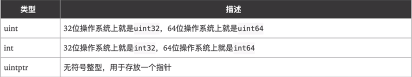
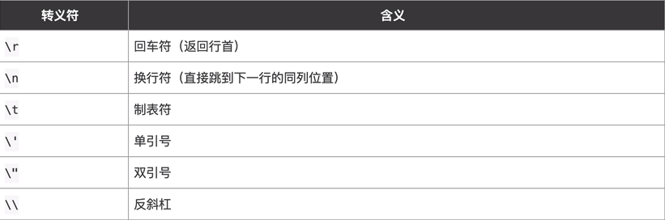

一、数据类型概要


二、整数类型

1.整型


2.其他数字类型



注:

a.使用int和uint时要注意平台

b.在写二进制文件时不要使用int和uint

三、浮点数类型


注:

a.默认为float64

b.浮点数尾数可能丢失，造成精度损失

c.浮点数科学表示法的e和E都可以

四、字符型

```go
func main(){
    var c1 byte = 'a'
    //输出对于字符码值
    fmt.Println(c1)
    //输出字符本身
    fmt.Println("%c \n ", c1)
    
    var c2 int = '中' //用byte会溢出
    //输出对于字符码值
    fmt.Println(c2)
     //输出字符本身
    fmt.Printf("%c \n ", c2)
    
    var c3 int = 22113
    //输出对应unicode字符
    fmt.Printf("%c \n ", c3)
    
    var c4 int = 10 + 'a'
    //用码值进行运算，输出码值
    fmt.Println(c4)
    //用码值进行运算，输出ASCII码
    fmt.Printf("%c \n ", c4)
}
```

注:

1.字符型只能存字母，字母占一个字节，汉字占三个字节

2.Golang没有字符型，一般用byte，使用UTF-8编码

3.如果小于255用byte，否则用int

4.byte:unit8的别名；rune:int32的别名

五、布尔类型

1.默认为false

2.只能取true或false，不能用0或1代替

3.不能将整型强制转换为布尔型

4.布尔值不能参与运算

六、字符串类型

1.在Golang中字符串不可变

2.转义



3.使用反引号``，输出大批代码，不用转义

4.字符串拼接过长时可以换行，但要把+留在上面

5.字符串常用操作


七、复数

complex64和complex128

```go
var c1 complex64 = 1 + 2i
var c2 complex128 = 2 + 3i
```

八、基本数据类型默认值

```go
var a int //0
var b float32 //0
var c float64 //0
var isknow bool //false
var name string //""
```

九、数据类型转换

注:Golang基本数据类型转换必须显示转换，不能自动转换

1.基本数据类型相互转换


2.基本数据类型转string类型

方式一

方式二


注意导入strconv包

3.string转基本数据类型(注意导入strconv包)


注:如果将"hello"转换整数，结果为0，请注意转换有效性
