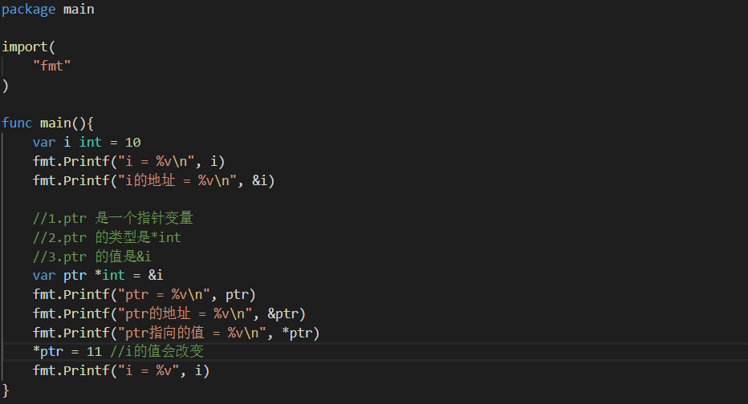

一、指针及其内存布局

```go
package main

import (
	"fmt"
)

func main() {
	//普通变量
	var i int = 10

	fmt.Printf("i = %v\n", i)     //打印普通变量值
	fmt.Printf("i的地址 = %v\n", &i) //打印普通变量地址

	//指针变量
	var ptr *int = &i

	fmt.Printf("ptr=%v\n", ptr)      //打印ptr值，是个地址
	fmt.Printf("ptr的地址=%v\n", &ptr)  //打印ptr的地址
	fmt.Printf("ptr指向的值=%v\n", *ptr) //打印ptr指向的变量的值，即i=10

	*ptr = 11             //i的值会改变
	fmt.Printf("i=%v", i) //i=11
}
```



二、指针使用细节

指针变量于执向变量数据类型需要一致

```go
var a int = 300
var ptr *float32 = &a //编译会报错
```

注:值类型都有对应指针类型，形式为*数据类型

