一、单分支

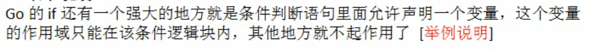

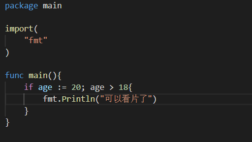

二、双分支

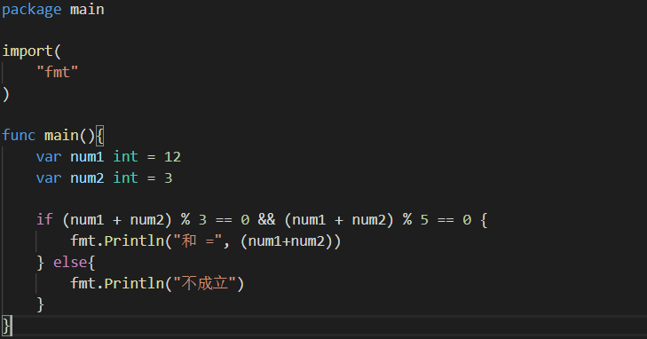

注:

1.执行条件不用()包起来，虽然不会保存，编译也能运行

2.不论执行语句有几行，都要用{}包起来

3.else不用换号

4.if的条件判断式不能有赋值语句

示例:

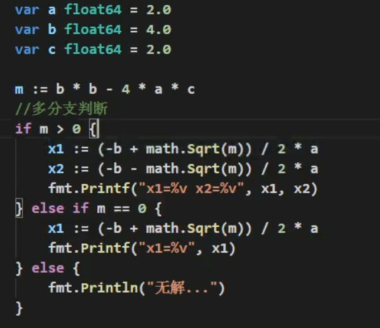

注意导入math包
<<<<<<< HEAD

三、switch

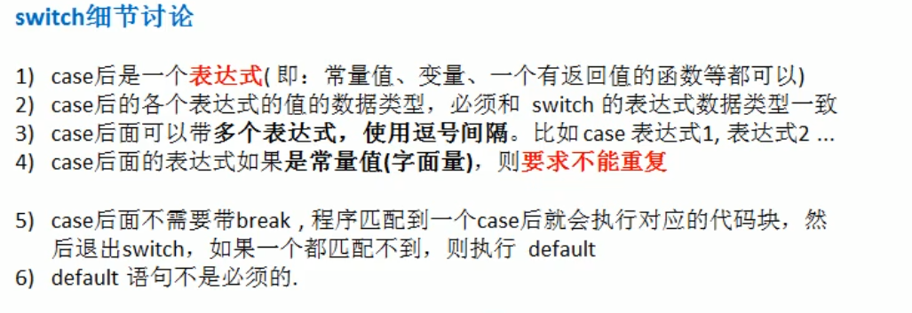

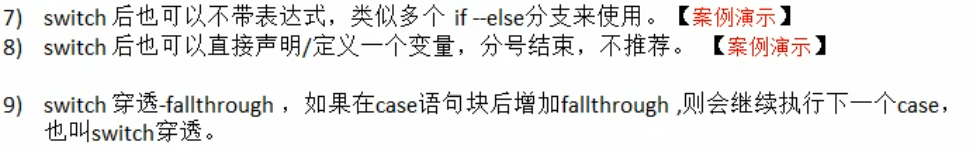

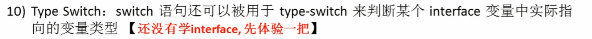

1)case后是一个表达式

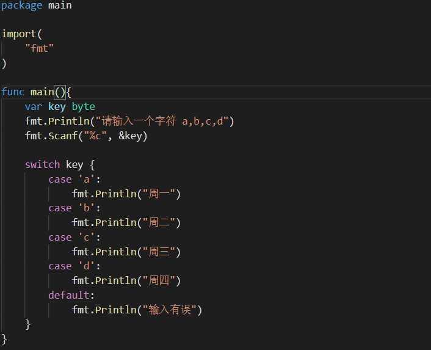

2)case后表达式的数据类型要与switch数据类型保持一致

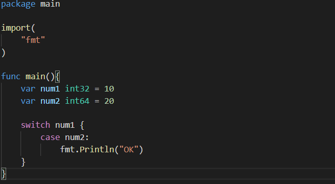

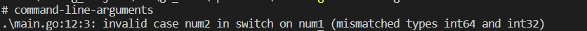

注:

如果num2是一个具体的值，如20就可以，类似于20把值赋给num1，而num2赋值给num1不行

3)case后可以带多个表达式

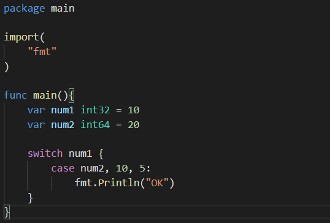

4)case表达式如果后面是常量，则不能重复

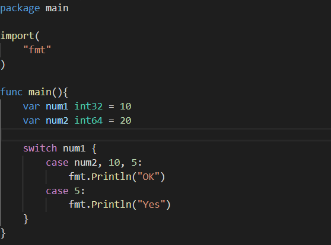

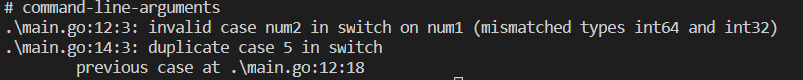

注:可以用变量

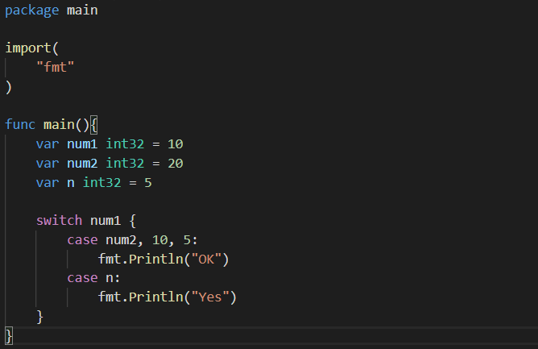

7)switch可以不带表达式，类似于if-else

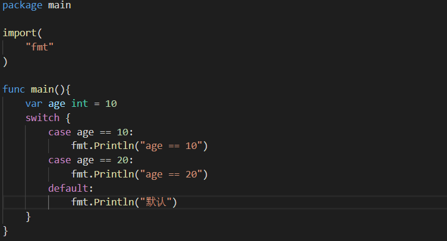

8)switch后可以直接声明一个变量，分号结束，不推荐

9)switch可以用fallthrough穿透

10)判断interface中变量实际指向的变量类型

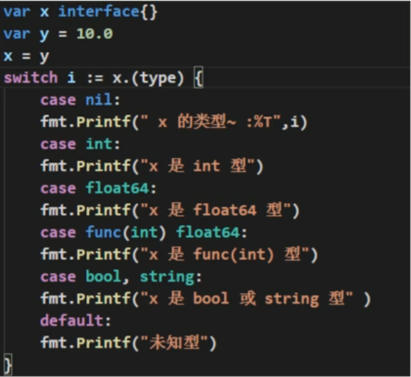

四、for循环

1.for循环的三种写法

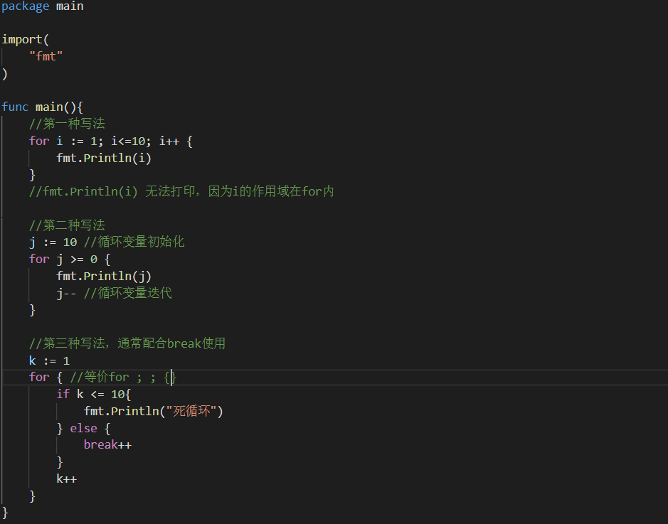

2.for循环遍历字符串

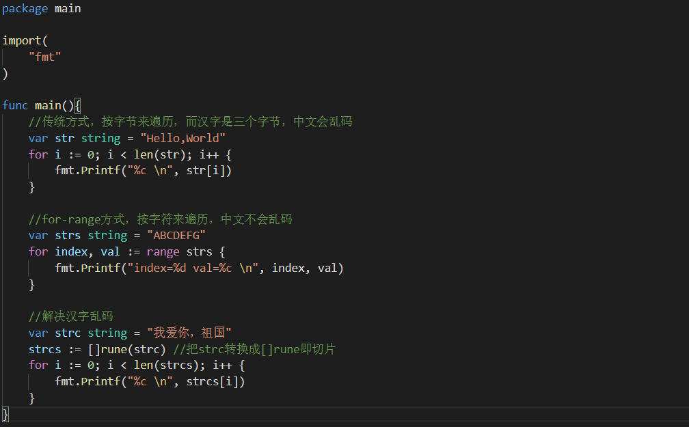

3.练习

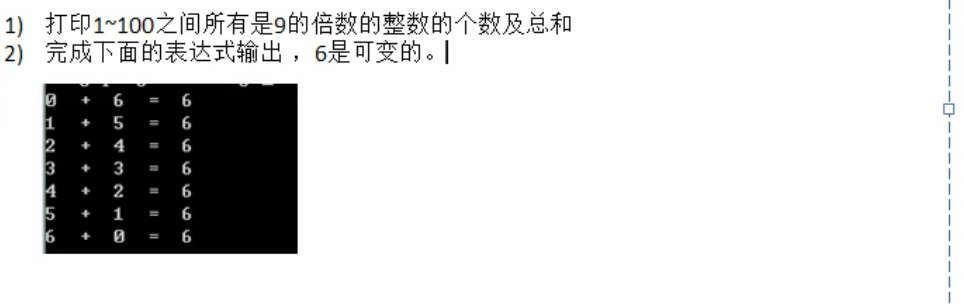

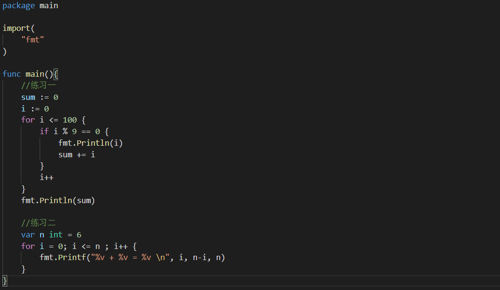

五、while和do while

golang中没有while和do while，可以用for循环代替

六、经典练习

1.打印空心金字塔

2.统计3个班，每个班5名同学，求出各个班平均分，所有班级平均分，所有班级及格人数

3.打印九九乘法表

七、break

1.练习

2.标签指明终止层数

注:不使用标签就是就近原则

八、continue

1.练习

2.break和continue综合练习

九、goto

打印结果为:OK1 OK2 OK3

十、return(跳出所在方法或函数)

