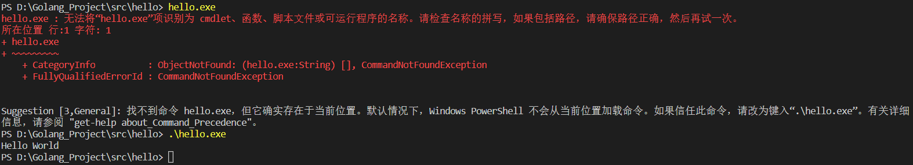

一、编译

```go
go buid //代码包中有且仅有一个命令源码文件且在文件夹所在目录中执行
```

二、指定编译后二进制文件名字

```go
go buid -o xxx.exe //代码包中有且仅有一个命令源码文件且在文件夹所在目录中执行
```

三、执行生成的二进制文件

```go
.\xxx.exe //直接xxx.exe就行，但个人情况特殊
```



四、直接执行源代码(不编译)

```go
go run xxx.go //只能执行单个源文件
```

五、在任何路径执行二进制文件

```go
go install //会在bin目录下生成一个二进制文件

xxx.exe //任意目录执行
```

六、跨平台编译

```go
SET CGO_ENABLED=0
SET GOOS=linux //改成linux
SET GOARCH=amd64
go build

SET GOOS=windows //改成windows
```

